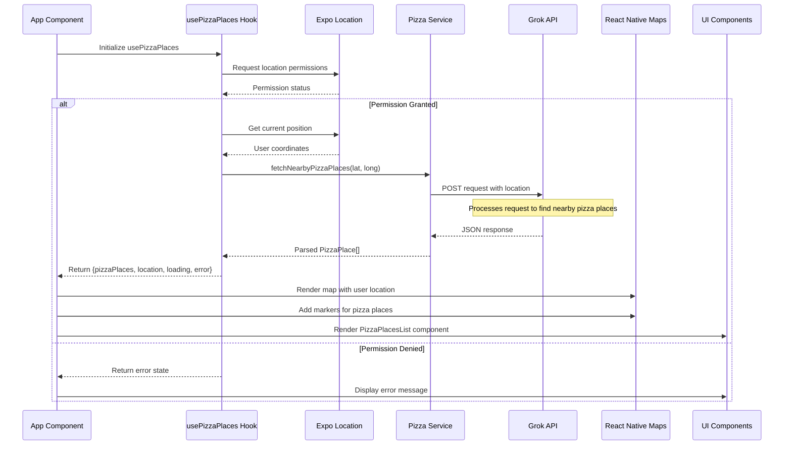

# APP FLOW 

```mermaid
sequenceDiagram
    participant App as App Component
    participant Hook as usePizzaPlaces Hook
    participant Location as Expo Location
    participant PizzaService as Pizza Service
    participant GrokAPI as Grok API
    participant MapView as React Native Maps
    participant UI as UI Components

    App->>Hook: Initialize usePizzaPlaces
    
    Hook->>Location: Request location permissions
    Location-->>Hook: Permission status
    
    alt Permission Granted
        Hook->>Location: Get current position
        Location-->>Hook: User coordinates
        
        Hook->>PizzaService: fetchNearbyPizzaPlaces(lat, long)
        PizzaService->>GrokAPI: POST request with location
        Note over GrokAPI: Processes request to find nearby pizza places
        GrokAPI-->>PizzaService: JSON response
        PizzaService-->>Hook: Parsed PizzaPlace[]
        
        Hook-->>App: Return {pizzaPlaces, location, loading, error}
        
        App->>MapView: Render map with user location
        App->>MapView: Add markers for pizza places
        App->>UI: Render PizzaPlacesList component
    else Permission Denied
        Hook-->>App: Return error state
        App->>UI: Display error message
    end
```
